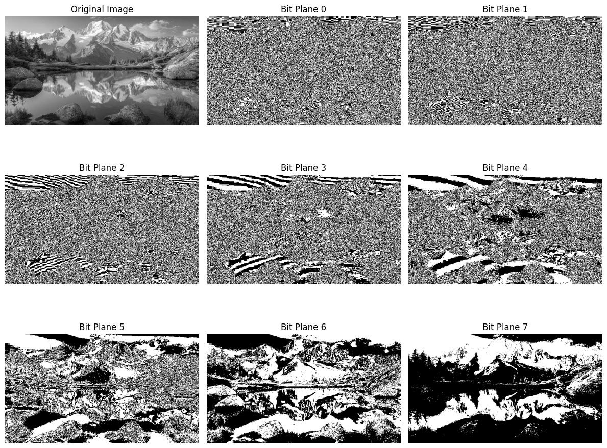

# Bit Plane Slicing Using OpenCV

## Output: The output below shows the original image and the results obtained using bit plane slicing from bit plane 0 to bit plane 7.

# Author

**Vecha Nagasai**
